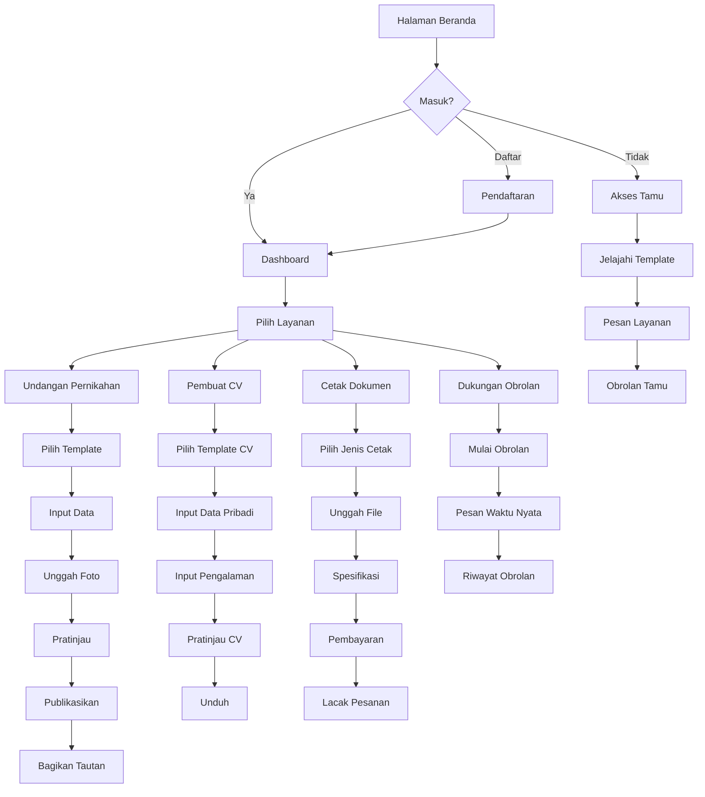
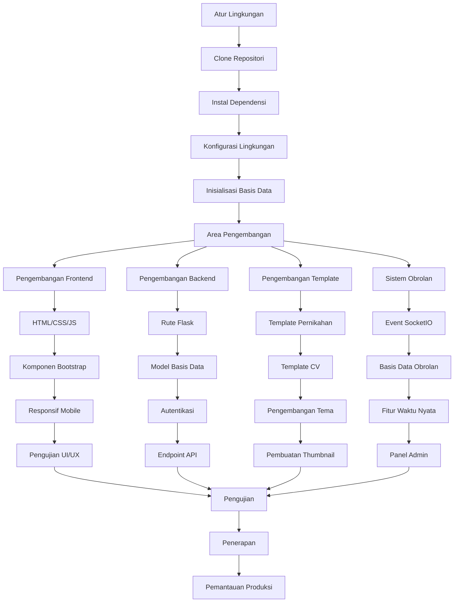
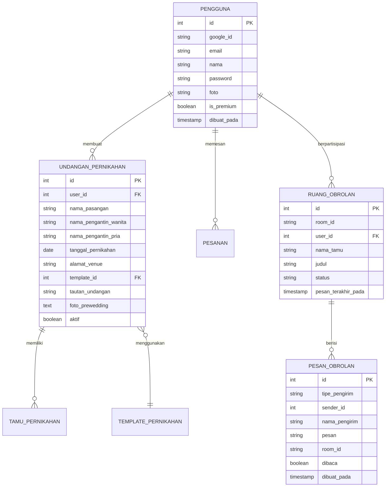

# 🌸 Fajar Mandiri Store - Sistem Manajemen Undangan & CV

**Platform digital terpercaya untuk membuat undangan pernikahan dan CV profesional dengan sistem manajemen pesanan cetak terintegrasi dan chat realtime.**
## 🪟 **Instalasi Windows Installer**

### 📦 **Download & Install (Recommended)**
```
🎯 CARA TERMUDAH - INSTALLER SIAP PAKAI
```

#### ⚡ **Quick Install**
1. **Download Installer**: Unduh file `FajarMandiriStore-Setup.exe`
2. **Run Installer**: Jalankan sebagai Administrator
3. **Follow Wizard**: Ikuti panduan instalasi Inno Setup
4. **Ready to Use**: Aplikasi siap digunakan langsung
5. **⚠️ Known Issues**: Beberapa fitur masih bermasalah, akan diperbaiki segera

#### 🔧 **System Requirements Windows**
- **OS**: Windows 10/11 (64-bit recommended)
- **RAM**: 4GB minimum, 8GB recommended
- **Storage**: 2GB free space
- **Internet**: Koneksi internet untuk fitur online
- **Browser**: Chrome/Edge untuk thumbnail generation

#### 🚀 **Keunggulan Installer**
- **One-Click Install**: Instalasi otomatis dengan Inno Setup
- **Desktop Shortcut**: Shortcut otomatis dibuat
- **Auto Updates**: Sistem update otomatis (coming soon)
- **Uninstaller**: Uninstall bersih dengan Inno Setup
- **Production Ready**: Siap digunakan untuk operasional tahun ini

### ⏰ **Timeline & Update**
- **📅 Deployment**: Aplikasi akan digunakan dalam waktu dekat (2025)
- **🔧 Bug Fixes**: Perbaikan fitur dan bugs akan segera diatasi
- **📈 Updates**: Update berkala untuk memperbaiki masalah yang ada
- **🎯 Target**: Stabilitas dan user experience yang lebih baik

---# 🌸 Toko Fajar Mandiri - Sistem Manajemen Undangan & CV

**Platform digital terpercaya untuk membuat undangan pernikahan dan CV profesional dengan sistem manajemen pesanan cetak terintegrasi dan obrolan waktu nyata.**


## 📋 Daftar Isi
- [Status Pengembangan](#️-status-pengembangan)
- [Instalasi Windows](#-instalasi-windows-installer)
- [Fitur Utama](#-fitur-utama)
- [Teknologi](#-teknologi--arsitektur)
- [Instalasi Manual](#-instalasi-manual--pengaturan)
- [Diagram Alur Sistem](#-diagram-alur-sistem)
- [Penggunaan](#-panduan-penggunaan)
- [Dokumentasi API](#-dokumentasi-api)
- [Masalah & Roadmap](#-masalah-yang-diketahui--status-pengembangan)
- [Kontribusi](#-kontribusi)
- [Dukungan](#-dukungan--komunitas)

## ⚠️ **Status Pengembangan**

### 📅 **Informasi Versi**
- **Versi Saat Ini**: 1.5 Revisi 5 (2025)
- **Status**: Dalam Pengembangan Aktif
- **Fitur Baru**: Sistem chat admin-user (baru ditambahkan)
- **Target Versi Stabil**: 2.0 (2027)
- **🪟 Windows Installer**: Tersedia installer Inno Setup siap pakai

### 📦 **Distribusi Aplikasi**
- **💻 Windows Application**: Dikemas menggunakan Inno Setup Installer
- **🚀 Ready to Use**: Installer siap pakai meskipun beberapa fitur bermasalah
- **⏰ Timeline**: Aplikasi akan digunakan dalam jangka waktu dekat (2025)
- **🔧 Update Schedule**: Perbaikan fitur dan bugs akan segera diatasi

### 🚧 **Fitur yang Belum Lengkap**
| Fitur | Status | Keterangan |
|-------|--------|------------|
| RSVP System | ❌ Tidak Berfungsi | Masih dalam perbaikan |
| CV Generator | ⚠️ Bermasalah | Fungsionalitas terbatas |
| Thumbnail Generator | ❌ Bermasalah | Sistem pembuatan thumbnail error |
| Template Premium | ⚠️ Terbatas | Hanya menampilkan 1 acara (Akad) |
| Chat Scroll | ⚠️ Bermasalah | Widget chat scroll tidak lancar |
| Database | ⚠️ SQLite | Belum migrasi PostgreSQL |

## ✨ Fitur Utama

### 💍 **Undangan Pernikahan Digital**

#### 🎨 **Koleksi Template Premium**
- **18+ Template Profesional**: Elegan Klasik, Minimal Modern, Emas Royal, Romantis Taman, Gelombang Laut, Pesona Vintage, dan lainnya
- **Desain Mobile-First**: Optimasi layar penuh untuk Android & iOS
- **Tata Letak Responsif**: Tampilan sempurna di semua perangkat
- **Dukungan Multi-Acara**: Akad, Resepsi, Acara Keluarga terpisah

#### 🔧 **Kustomisasi Lengkap**
- **Data Mempelai**: Nama lengkap, gelar, orang tua, foto pasangan
- **Multi-Venue Support**: Template biasa mendukung 4 acara, premium hanya 1 acara
- **Galeri Foto**: Upload hingga 10 foto prewedding dengan orientasi otomatis
- **Background Music**: Upload custom atau pilih dari koleksi
- **Payment Integration**: Info rekening, QRIS, e-wallet
- **⚠️ File Storage**: Template tersimpan di folder dokumen komputer lokal

#### 📱 **Fitur Interaktif Modern**
- **Sistem RSVP**: ⚠️ Dalam pengembangan - belum berfungsi
- **Manajemen Tamu**: Pelacakan tamu dan ucapan
- **Generator Kode QR**: Akses mudah melalui pemindaian
- **Berbagi Sosial**: Tautan berbagi yang ramah SEO

#### 💬 **Sistem Chat Realtime (FITUR BARU v1.5)**

#### 🎯 **Widget Obrolan Mengambang**
- **Dukungan Multi-Pengguna**: Pengguna terdaftar, tamu, dan admin
- **Pesan Waktu Nyata**: Didukung oleh Flask-SocketIO
- **Penyimpanan Persisten**: Semua percakapan tersimpan ke basis data
- **Admin Dashboard**: Kelola semua obrolan dari satu tempat
- **⚠️ Masalah Diketahui**: Scroll dalam chat widget masih bermasalah

#### 📊 **Manajemen Obrolan**
- **Manajemen Ruang**: Otomatis membuat ruang per pengguna/tamu
- **Status Pesan**: Pelacakan dibaca/belum dibaca
- **Riwayat Obrolan**: Riwayat lengkap percakapan
- **Sistem Notifikasi**: Peringatan untuk pesan baru

#### 🔐 **Keamanan & Privasi**
- **Akses Berbasis Peran**: Izin Pengguna, Tamu, Admin
- **Pesan Aman**: Validasi input dan sanitisasi
- **Manajemen Sesi**: Kontrol akses ruang yang aman

### 📄 **Pembuat CV Profesional**

#### 🎯 **Variasi Template**
- **⚠️ Dalam Pengembangan**: CV Generator masih dalam tahap pengembangan
- **Template Tersedia**: Terbatas dan masih dalam perbaikan
- **Ramah ATS**: Target optimasi untuk Sistem Pelacakan Pelamar
- **Siap Cetak**: Target kualitas ekspor resolusi tinggi
- **⚠️ Masalah Diketahui**: Pembuatan thumbnail masih bermasalah

#### 📝 **Sistem Input Lengkap**
- **Data Pribadi**: Info kontak, foto profesional
- **⚠️ Status**: CV Generator masih dalam pengembangan
- **Formulir Dinamis**: Target entri pendidikan & pengalaman tanpa batas
- **Manajemen Keahlian**: Target berbasis tag dengan kategorisasi
- **Integrasi Kode QR**: Target kode QR vCard untuk CV digital

### 🖨️ **Sistem Cetak & Pesanan Terintegrasi**

#### 📋 **Jenis Layanan Cetak**
| Kategori | Barang | Spesifikasi |
|----------|-------|-------------|
| **Dokumen** | Surat, Proposal, Laporan | A4, F4, Legal |
| **Foto Digital** | 2x3, 3x4, 4x6, 5x7, 8x10, A4, A3 | Glossy, Matte |
| **Pemasaran** | Brosur, Flyer, Banner, Poster | Indoor/Outdoor |
| **Pribadi** | Kartu Nama, Kartu ID, Stiker | Desain kustom |
| **Pernikahan** | Undangan fisik, Souvenir | Bahan premium |

### 👨‍💼 **Sistem Manajemen Admin**

#### 📊 **Analitik Dashboard**
- **Statistik Waktu Nyata**: Registrasi pengguna, pesanan, pendapatan
- **⚠️ Manajemen Template**: Upload, edit - thumbnail generation bermasalah
- **Administrasi Obrolan**: Monitor dan kelola semua percakapan (BARU!)
- **Pelacakan Pesanan**: Manajemen transaksi lengkap

## 🚀 **Teknologi & Arsitektur**

### 💻 **Tech Stack**
- **Backend**: Python Flask 2.3.3 + Flask-SocketIO
- **Database**: SQLite (akan migrasi ke PostgreSQL di versi 2.0)
- **Frontend**: Bootstrap 5, jQuery, FontAwesome 6
- **Real-time**: WebSocket untuk sistem chat
- **File Storage**: Penyimpanan lokal (folder template di dokumen komputer)
- **Upload Storage**: Semua upload tersimpan di folder dokumen lokal
- **Authentication**: Flask-Login, Google OAuth 2.0
- **Media Processing**: PIL, QR Code generation, Selenium (masih bermasalah)

### 🔧 **Dependensi Utama**
```txt
Flask==2.3.3
flask-socketio          # Obrolan waktu nyata
pystray==0.19.5         # Antarmuka system tray
psutil==5.9.6           # Manajemen proses
selenium==4.15.0        # Pembuatan thumbnail
pillow==10.1.0          # Pemrosesan gambar
qrcode[pil]==7.4.2      # Pembuatan kode QR
google-auth-oauthlib    # Integrasi OAuth
```

## 📦 **Instalasi Manual & Pengaturan**

### 🔧 **Persyaratan Development**
- Python 3.8+
- RAM 2GB minimum
- Ruang penyimpanan 1GB (termasuk folder template lokal)
- Browser Chrome/Chromium (untuk thumbnail generation - masih bermasalah)
- Koneksi internet
- **⚠️ Catatan**: Template disimpan di folder dokumen komputer lokal

### ⚡ **Instalasi Manual (Untuk Developer)**
```bash
# 1. Clone repositori
git clone https://github.com/fajarjulyana/fajarmandiri.store.git
cd fajarmandiri.store

# 2. Instal dependensi
pip install -r requirements.txt

# 3. Atur variabel lingkungan
export FLASK_SECRET_KEY="kunci-super-rahasia-anda-di-sini"
export GOOGLE_CLIENT_ID="id-klien-google-anda"
export GOOGLE_CLIENT_SECRET="rahasia-klien-google-anda"

# 4. Inisialisasi basis data
python -c "from app import init_db; init_db()"

# 5. Jalankan aplikasi (versi pengembangan)
python app.pyw

# CATATAN: Pastikan folder template tersedia di dokumen komputer
```

### 🌐 **Variabel Lingkungan**
```env
FLASK_SECRET_KEY=kunci-rahasia-anda
FLASK_ENV=development
GOOGLE_CLIENT_ID=id-klien-google-anda
GOOGLE_CLIENT_SECRET=rahasia-klien-google-anda
DATABASE_URL=sqlite:///fajarmandiri.db
UPLOAD_FOLDER=static/uploads
MAX_CONTENT_LENGTH=16777216
```

## 🗺️ **Diagram Alur Sistem**

### 👤 **Alur Pengguna**



### 🔧 **Alur Pengembang**



### 🗃️ **Arsitektur Basis Data**



## 🎯 **Panduan Penggunaan**

### 💒 **Membuat Undangan Pernikahan**
1. **Masuk**: Daftar atau masuk dengan Google
2. **Pemilihan Template**: Pilih dari 4 template (3 premium + 1 biasa)
3. **⚠️ Keterbatasan**: Template premium hanya menampilkan acara Akad
4. **Template Biasa**: Mendukung 4 acara (Akad, Resepsi, Acara Mempelai Wanita, Acara Mempelai Pria)
5. **Input Data**: Isi informasi mempelai
6. **Unggah Foto**: Unggah hingga 10 foto prewedding
7. **Musik & Pembayaran**: Atur musik latar dan info pembayaran
8. **Pratinjau & Publikasi**: Tinjau dan publikasikan undangan
9. **⚠️ RSVP**: Fitur RSVP belum berfungsi dengan baik

### 📄 **Menghasilkan CV Profesional**
1. **⚠️ Status**: CV Generator masih dalam tahap pengembangan
2. **Template Terbatas**: Hanya beberapa template yang tersedia
3. **Masalah Thumbnail**: Pembuatan pratinjau masih bermasalah
4. **Target Fitur**:
   - Pemilihan template sesuai industri
   - Input data pribadi dan foto profesional
   - Formulir dinamis untuk pengalaman dan pendidikan
   - Sistem tag untuk keahlian
   - Pratinjau waktu nyata dan unduh

### 💬 **Menggunakan Sistem Obrolan (FITUR BARU v1.5)**
1. **Mulai Obrolan**: Klik tombol obrolan mengambang
2. **Pesan Waktu Nyata**: Kirim pesan ke admin dan sebaliknya
3. **⚠️ Masalah Scroll**: Widget chat mengalami masalah scroll
4. **Riwayat Obrolan**: Akses riwayat percakapan
5. **Berbagi File**: Fitur upload file (dalam pengembangan)

## 🔧 **Dokumentasi API**

### 🌐 **Endpoint REST**

#### Autentikasi
```http
POST /login                 # Masuk pengguna
POST /register             # Pendaftaran pengguna
GET /signin                # Google OAuth
GET /signout               # Keluar
```

#### Undangan Pernikahan
```http
GET /wedding-invitations              # Daftar undangan pengguna
POST /create-wedding-invitation       # Buat undangan baru
GET /wedding/<link>                   # Lihat undangan publik
POST /rsvp/<invitation_id>           # Pengiriman RSVP
```

#### Sistem Obrolan
```http
GET /chat                    # Antarmuka obrolan
GET /chat?room_id=<id>      # Bergabung ruang tertentu
```

#### Event WebSocket
```javascript
// Klien ke Server
socket.emit('join_room', {room_id: 'room_123'});
socket.emit('send_message', {
    room_id: 'room_123',
    message: 'Halo',
    sender_type: 'user',
    sender_name: 'John Doe'
});

// Server ke Klien
socket.on('new_message', function(data) {
    // Tangani pesan baru
});
socket.on('room_joined', function(data) {
    // Berhasil bergabung ruang
});
```

## 🛠️ **Pengembangan Lanjutan**

### 📝 **Alur Kerja Pengembangan**
1. **Fork Repositori**: Clone untuk pengembangan
2. **Cabang Fitur**: Buat cabang untuk fitur baru
3. **Pengujian Lokal**: Uji di lingkungan lokal
4. **Tinjauan Kode**: Kirimkan PR untuk ditinjau
5. **Pengujian Integrasi**: Uji dengan fitur lain
6. **Penerapan**: Deploy ke produksi

### 🎨 **Pengembangan Template**
1. **Template Dasar**: Gunakan `templates/admin/base_template.html`
2. **Variabel CSS**: Implementasi kustomisasi tema
3. **Desain Responsif**: Pendekatan mobile-first
4. **Pengujian**: Pratinjau dengan data sampel
5. **Thumbnail**: Auto-generate dengan Selenium

### 💡 **Praktik Terbaik**
- **Gaya Kode**: Ikuti PEP 8 untuk Python
- **Keamanan**: Validasi input dan sanitisasi
- **Performa**: Optimalkan kueri basis data
- **Mobile**: Uji di berbagai perangkat
- **Aksesibilitas**: Kepatuhan WCAG 2.1

## 🧪 **Pengujian**

### 🔍 **Cakupan Tes**
```bash
# Jalankan tes
python -m pytest tests/

# Uji sistem obrolan
python test_chat.py

# Pengujian performa
python test_performance.py
```

### 📊 **Kasus Tes**
- **Tes Unit**: Fungsionalitas inti (cakupan 90%+)
- **Tes Integrasi**: Sistem obrolan, pembayaran
- **Tes UI**: Kompatibilitas lintas browser
- **Tes Mobile**: Desain responsif
- **Tes Beban**: Koneksi WebSocket

## 🚀 **Penerapan di Replit**

### ☁️ **Penerapan Otomatis**
1. **Fork Template**: Import ke Replit
2. **Pengaturan Lingkungan**: Atur rahasia dan variabel
3. **Konfigurasi Jalankan**: Python app.pyw
4. **Auto-scaling**: Penerapan Replit bawaan

### 🔧 **Pengaturan Produksi**
```python
# Konfigurasi produksi (Target versi 2.0)
DEBUG = False
TESTING = False
# Target: Migrasi ke PostgreSQL di versi 2.0 (2027)
DATABASE_URL = "sqlite:///fajarmandiri.db"  # Saat ini masih SQLite
```

### ⚠️ **Catatan Pengembangan**
- Database masih menggunakan SQLite
- Migrasi PostgreSQL direncanakan untuk versi 2.0
- Template disimpan di folder dokumen lokal
- Upload file masuk ke dokumen database lokal

## 📈 **Pemantauan & Analitik**

### 📊 **Metrik Bisnis**
- **Pertumbuhan Pengguna**: Registrasi dan retensi
- **Analitik Obrolan**: Waktu respons, tingkat resolusi
- **Performa Template**: Desain paling populer
- **Pelacakan Pendapatan**: Tingkat konversi pesanan

### 🔍 **Pemantauan Teknis**
- **Koneksi WebSocket**: Sesi obrolan aktif
- **Performa Basis Data**: Optimasi kueri
- **Pelacakan Error**: Notifikasi error waktu nyata
- **Pemantauan Uptime**: Target ketersediaan 99.9%

## 🤝 **Kontribusi**

### 💡 **Cara Berkontribusi**
1. **Fork Repositori**: Buat salinan untuk pengembangan
2. **Cabang Fitur**: `git checkout -b fitur/peningkatan-obrolan`
3. **Kode & Uji**: Implementasi dengan pengujian lengkap
4. **Dokumentasi**: Perbarui README untuk perubahan
5. **Pull Request**: Kirim dengan deskripsi detail

### 📋 **Pedoman Kontribusi**
- **Kualitas Kode**: Pertahankan cakupan tes 90%+
- **Dokumentasi**: Perbarui untuk setiap fitur baru
- **Keamanan**: Ikuti praktik coding yang aman
- **Performa**: Optimalkan untuk perangkat mobile

## 📞 **Dukungan & Komunitas**

### 🏢 **Informasi Kontak**
**Toko Fajar Mandiri**  
Platform Digital untuk Layanan Pernikahan & Profesional

👤 **Pemilik**: Fajar Julyana  
📧 **Email Resmi**: fajarjulyana@fajarmandiri.store  
📧 **Email Pribadi**: fajarjulyana1@gmail.com  
📱 **WhatsApp**: +6281804411937  
💬 **Obrolan**: Gunakan widget obrolan di website  
🌐 **Website**: https://fajarmandiri.store  
🔗 **Source Code**: https://github.com/fajarjulyana/fajarmandiri.store.git  
📍 **Alamat**: Jakarta, Indonesia  

### 👥 **Tim Pengembangan**
- **Pemilik & Founder**: Fajar Julyana - Founder dan Pengembang Utama
- **Lead Developer**: Fajar Julyana - Full-stack Development
- **Project Manager**: Fajar Julyana - Manajemen Proyek dan Strategi
- **DevOps & Maintenance**: Fajar Julyana - Deployment dan Pemeliharaan

**Kontak Developer**:
- 📧 Email: fajarjulyana1@gmail.com
- 📱 WhatsApp: +6281804411937
- 🐙 GitHub: https://github.com/fajarjulyana

### 🛠 **Masalah yang Diketahui & Status Pengembangan**

#### 🚨 **Masalah Utama Versi 1.5**
- [ ] **RSVP System**: Belum berfungsi dengan baik
- [ ] **CV Generator**: Masih dalam tahap pengembangan
- [ ] **Thumbnail Generator**: Sistem pembuatan thumbnail bermasalah
- [ ] **Scroll Chat**: Widget chat mengalami masalah scroll
- [ ] **Template Premium**: Hanya menampilkan 1 acara (Akad saja)
- [ ] **File Management**: Template tersimpan di folder lokal komputer
- [ ] **Database**: Masih menggunakan SQLite, belum migrasi PostgreSQL

#### 🔧 **Dalam Perbaikan**
- [ ] Optimasi basis data obrolan untuk volume tinggi
- [ ] Perbaikan UI untuk antarmuka obrolan mobile
- [ ] Integrasi unggah file dalam sistem obrolan
- [ ] Notifikasi push untuk pengguna offline
- [ ] **UI/UX Overhaul**: Perombakan total interface untuk user-friendly

#### 🗺️ **Roadmap 2026**
- **Q1 2026**: Perbaikan RSVP system dan template premium multi-acara
- **Q2 2026**: CV Generator sepenuhnya fungsional dengan thumbnail otomatis
- **Q3 2026**: Migrasi database ke PostgreSQL dan optimasi performa
- **Q4 2026**: UI/UX overhaul lengkap untuk user experience yang lebih baik

#### 🎯 **Target Pengembangan Prioritas**
- **Versi 1.6 (Q2 2025)**: Perbaikan RSVP dan chat scroll issues
- **Versi 1.7 (Q3 2025)**: CV Generator fungsional dan thumbnail fix
- **Versi 1.8 (Q4 2025)**: Template premium multi-acara
- **Versi 1.9 (Q1 2026)**: UI/UX overhaul complete
- **Versi 2.0 (2027)**: Versi stabil dengan semua fitur lengkap

#### 🔄 **Update Cycle**
- **🚨 Hotfixes**: Perbaikan critical bugs (mingguan)
- **🔧 Minor Updates**: Perbaikan fitur (bulanan)  
- **🚀 Major Updates**: Fitur baru dan overhaul (quarterly)
- **📱 Windows Updates**: Update installer otomatis

### 📄 **Lisensi & Hak Cipta**

### 📝 **Syarat Layanan**
- **Hak Penggunaan**: Lisensi non-eksklusif untuk platform
- **Privasi Data**: Perlindungan data yang patuh GDPR
- **Data Obrolan**: Penyimpanan terenkripsi dan aman
- **Akses API**: Pembatasan tingkat untuk penggunaan yang adil
- **Windows Distribution**: Installer Inno Setup untuk distribusi Windows

### 🛡️ **Keamanan & Kepatuhan**
- **Enkripsi Data**: AES-256 untuk pesan obrolan
- **Keamanan WebSocket**: Autentikasi berbasis token
- **HTTPS Saja**: Protokol transmisi aman
- **Audit Berkala**: Penilaian keamanan pihak ketiga
- **Windows Security**: Code signing certificate (planned)

---

**© 2025 Fajar Julyana - Toko Fajar Mandiri. Semua hak dilindungi.**

*Platform digital dalam pengembangan untuk kebutuhan undangan pernikahan, CV profesional, dan komunikasi waktu nyata. Versi 1.5 Revisi 5 - Target versi stabil 2.0 pada tahun 2027.*

**Dibuat oleh**: Fajar Julyana  
**Kontak**: +6281804411937 | fajarjulyana@fajarmandiri.store  
**Tahun Pembuatan**: 2025  
**Status**: Pengembangan Aktif

[](https://fajarmandiri.store)
[](https://replit.com)
[](https://github.com/fajarjulyana/fajarmandiri.store.git)
[](https://github.com/fajarjulyana/fajarmandiri.store)
[](https://fajarmandiri.store)